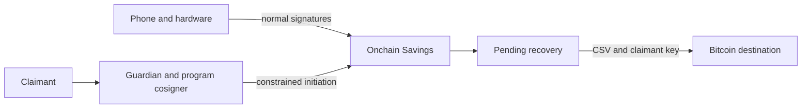
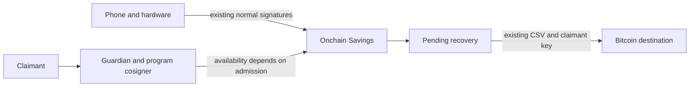

# Native Savings with committed timelocked recovery

## Decision

Prepare an isolated native Savings candidate. Its first deliverable is an executable transaction and recovery graph, followed by a decision about hardware authorization and key-loss recovery. Production remains on the existing contract while those questions are tested.

## Executive Recommendation

**Option 1: Retain existing Savings** preserves the current normal phone-plus-hardware transfer and avoids a funded migration. Its program-cosigned recovery initiation remains sensitive to signing-service admission changes.

**Option 2: Native Savings with committed recovery** places cooperative Savings operations in the supported Operator transaction flow and requires a locally recoverable Bitcoin fallback. This is the recommended research direction. Native admission, hardware transaction approval, and key-loss recovery are separate gates; none is established merely by adding an Operator key.

## Evidence

The following source was inspected at the revisions recorded in [the inventory](../context.md). Qualification reported by another task is labeled separately, since its funded tests were not rerun for this planning change.

| Evidence | Source and status | What it establishes |
| --- | --- | --- |
| `savings` | Runtime `internal/vault/savings/{family,trees}.go`, observed source | Normal Savings requires phone and hardware; initiation requires claimant and two program-derived cosigners. The pending claimant leaf contains CSV. |
| `admission` | Upstream emulator `internal/application/{onchain,tx,prevout}.go` and Operator `internal/core/application/service.go`, observed source | The onchain handler rejects Operator-bearing program leaves. Native submission validates checkpoints and backing VTXOs. |
| `connector` | Runtime connector `experiments/connector/{README.md,connector_test.go}`, inspected experiment | The old connector's program rejects omission, while the Bitcoin script test accepts omission with phone and all required online signing keys. A related counterexample uses the existing recovery-initiation leaf. |
| `light` | Light wallet `src/lib/vault/light/{recovery,recoveryArchive}.ts`, inspected source and coordination report | Native ancestry storage and Bitcoin-only exit execution already have a separate implementation. The Light task reported both a generated-contract exit and a confirmed enrolled, paid, renewed-output sweep using Bitcoin-only access with the Vault service stopped. |
| `timelocks` | [BIP 68](https://bips.dev/68/) and [BIP 112](https://bips.dev/112/), consensus specifications | Relative delays depend on confirmation history and correctly encoded transaction sequence and script conditions. |

The source supports an admission mismatch for the implemented L1 connector. It does not prove that every possible connector construction is impossible or that the inspected upstream revision matches any particular live deployment.

## Current Design And Failure Mode

Savings currently sits onchain. The normal leaf requires phone and hardware signatures; recovery initiation uses a claimant and two program-derived cosigner keys to constrain the pending destination. The claimant can spend the resulting pending output after its relative delay. Cancellation variants depend on the recorded descriptor and template, including whether server-free clawback was enrolled.

The full current tree already relies on honest program enforcement for recovery initiation. Its phone-plus-hardware normal leaf does not establish protection of the entire tree against phone-plus-all-cosigner compromise. Copying the recovery leaves into a new contract would copy that trust boundary as well.

The L1 connector candidate moves hardware approval to a separate ordinary Bitcoin input. Its signature binds a complete transaction, but online signing policy makes that input compulsory. Native admission adds a second issue: the stock flow validates checkpoint-backed VTXOs. An ordinary hardware UTXO cannot be assumed admissible as an extra input, and replacing it with a VTXO invalidates the existing device-compatibility evidence.

## Desired Invariants

- Every cooperative program transaction follows the selected Operator's validated native flow, including input ancestry, output rules, and signature ordering.
- The complete set of spendable leaves and any key-path authority appears in the authorization matrix. Hardware enforcement claims identify whether Bitcoin signatures or an honest program cosigner supplies the enforcement.
- Service disappearance after any supported lifecycle transition leaves a recoverable, fully committed path. Recovery needs user-held keys and Bitcoin access, with no fresh Guardian, Operator, or program-cosigner signature.
- A successor output has a verified recovery artifact before the wallet reports its lifecycle operation as safely complete. Interrupted finalization is reconciled explicitly, retaining the previous artifact and any successor evidence.
- Recovery delays, user-key thresholds, cancellation authority, and expiry deadlines are verified against the exact enrolled contract and transaction graph.
- Program names, descriptor versions, network pins, authenticated policy state, and private service configuration remain separate across contract generations.

## Constraints And Non-Goals

This branch prepares a replacement architecture without requiring the current Savings/Spending split, connector reserve, or Guardian workflow to survive unchanged. Retain a component only when it has a defined authorization, lifecycle, or recovery responsibility. A separate named Savings policy may still be justified if it protects a different amount or user-key threshold.

No production profile, Contract Pack, public API, schema, enrollment, deployment, or funds move belongs to this preparation change. There is no generic signing API, new SDK fork, automated migration, or new delegate daemon. Research identifiers must remain outside production enrollment until the contract is selected and qualified.

## Before Architecture

The deployed Savings normal path is separate from its service-assisted recovery initiation. Once a valid pending output exists, Bitcoin enforces its claimant delay; the diagram does not imply that initiation survives a service outage.

## Options

### Option 1: Retain existing Savings

The existing normal path remains a practical holding position when both user keys are available. Keeping it avoids address changes, a new expiry lifecycle, and a forced migration before hardware behavior is understood. If service admission changes, recovery initiation may be unavailable even while a normal transfer remains possible. Existing descriptors and recovery artifacts must continue to determine the available routes.

Operationally, this option can preserve the current release while identifying affected capabilities and directing eligible users through the existing validated normal transfer. It cannot manufacture a replacement recovery path for an already funded output. A key-loss case must be handled according to the existing script and available services, without promising a newly added timeout.

| Change | Before | After | Security consequence | Cost |
| --- | --- | --- | --- | --- |
| Contract | Existing Savings | Same contract | Normal authority and existing recovery trust remain | No migration; affected initiation may remain unavailable |
| Incident handling | Current service behavior | Capability-specific qualification | Avoids relying on an unqualified signing route | Manual service and descriptor checks |

This option is preferable if native hardware approval or complete recovery cannot be qualified. It buys time while preserving the normal user-key path, but it is not a resolution of recovery admission incompatibility.

### Option 2: Native Savings with committed recovery

A native Savings output can require the Operator in its cooperative leaf while a named Guardian program constrains the intended transfer. The first experiment must establish the complete accepted transaction shape. Begin with a minimal native output and its exit, then add hardware authorization only through an input and signing construction accepted by the stock Operator and supported wallet. Copying the L1 PSBT handoff would skip this boundary.

There are two hardware outcomes to report. A direct hardware signature required by every relevant unauthorized-spend route could provide Bitcoin enforcement, subject to the recovery exceptions explicitly chosen. A program that requires a hardware connector or approval can provide enforcement while the required policy cosigner is honest. If the phone and every online signing key, including the Operator key, can sign an alternate spend without hardware, the strict requirement fails. An honest-cosigner design remains a separate candidate with that precise residual risk.

Recovery needs a second path through the committed Bitcoin graph. With both phone and hardware available, the first target is a delayed user-key exit that can complete after unrolling the necessary ancestors. This preserves joint authorization during an outage. Hardware loss and phone loss require additional design: an immediate lone-key bypass would weaken the wallet, while a precommitted pending-and-cancellation graph may preserve a contest period at the cost of setup, renewal, fee, and monitoring requirements. No unilateral single-key recovery leaf is selected by this plan.

Native Savings also acquires expiry and renewal obligations. Renewal can change ancestry even if an address or leaf remains identical. The wallet must retain new signed transactions and invalidate stale recovery-completeness claims; a delegation service cannot renew offline funds safely under a claim of current local recoverability unless updated recovery evidence reaches the required backup holder. Reuse Light's qualified capture and reconciliation patterns where their assumptions hold. Light's owner-only exit and allowance policy remain specific to Light.

| Change | Before | After | Security consequence | Cost |
| --- | --- | --- | --- | --- |
| Cooperative transaction | Ordinary Bitcoin Savings transfer | Native input and checkpoint flow | Aligns candidate with Operator admission; hardware enforcement still needs proof | Protocol coordination and device requalification |
| Outage recovery | Normal user-key path; initiation requires services | Committed ancestry plus delayed user-key exit | Removes fresh online signatures from the proposed outage path | Archive, confirmation waits, Bitcoin fees |
| Key loss | Existing pending family | Separately qualified pending/cancellation graph or explicit limitation | Prevents accidental lone-key authority expansion | Extra graph and adversarial tests if retained |
| Fund lifetime | Onchain Savings output | Expiring native output | Requires timely renewal or exit and successor backup | Monitoring and durable lifecycle state |

The principal benefit is compatibility with the supported cooperative flow while retaining a specified fallback. The principal cost is ownership of the complete native lifecycle. A feature flag can stop new enrollment; it cannot change the script of funded native Savings or restore the old recovery path.

## Comparison

Effects below are source-derived or hypothetical, not measured performance results. Security and recovery are acceptance criteria even when a faster implementation exists.

| Dimension | Option 1 | Option 2 | Basis and validation |
| --- | --- | --- | --- |
| Security | Existing normal hardware requirement and recovery trust | Cooperative hardware model unresolved; independent outage exit targeted | Source-derived, medium confidence; enumerate leaves and test all compromised-key combinations |
| Performance | Existing Bitcoin transfer behavior | Native coordination and archive writes add work; transfer latency needs measurement | Hypothetical, low confidence; compare signing and completion latency on identical payment workloads |
| Memory and storage | Existing recovery records | Signed ancestry grows with outputs and lifecycle depth | Source-derived direction, medium confidence; measure retained bytes and peak memory after repeated spend/renewal |
| Reliability | Normal path survives service outage with both keys; initiation may fail | Cooperative availability needs services; fallback should survive their loss | Source-derived baseline, proposed candidate; stop all services at every transition and complete Bitcoin recovery |
| Operations | Existing service incident handling | Expiry monitoring, recovery freshness, fee provisioning, and interrupted dispatch reconciliation | Hypothetical, medium confidence; crash/restart and expiry drills, with redacted diagnostics |
| Migration | No new contract | New profile and addresses; old and new funds need distinct recovery support | Source-derived, high confidence; mixed-generation restore and rollback rehearsal |
| Developer complexity | Existing split remains | Reuse native lifecycle code; remove unsupported L1 bridge assumptions | Hypothetical, medium confidence; review ownership and forbid generic signer escape routes |
| Reversibility | Existing release can remain | Preparation is reversible; funding requires an explicit exit or migration transaction | Source-derived, high confidence; rehearse stop-enrollment and drain separately |

Native Savings is justified only if admission and recovery tests pass with a hardware trust model the owner accepts. Faster cooperative transfers alone would not compensate for losing the ability to recover.

## Recommendation

Proceed with Option 2 as an isolated feasibility branch, retaining Option 1 as the operational baseline. If the native connector cannot provide device approval of the actual transaction, evaluate direct native hardware signing before adding bridge machinery. If neither is practical, leave the existing funded contract intact and present the alternative trust and product choices explicitly. Optional watch-only Savings in Light is a separate product configuration, not evidence that hardware-protected Savings has been replaced successfully.

## Evidence Coverage And Residual Risk

| Evidence | Option 1 | Option 2 | Remaining work |
| --- | --- | --- | --- |
| `savings`: current authority and delayed claim | Unaffected | Unknown until the replacement tree is fixed | Preserve old descriptor recovery; test all new leaves |
| `admission`: checkpoints and Operator-bearing leaves | Unaffected | Addresses intended flow, pending live qualification | Exact accepted transaction and service version record |
| `connector`: all-online-keys hardware omission | Unaffected in old normal path; present in existing initiation trust | Unknown; Operator presence alone does not remove it | Bitcoin-consensus bypass test including Operator compromise |
| `light`: archive and Bitcoin-only exit implementation | Unaffected | Mitigates implementation risk through reviewed reuse | Native Savings keys, scripts, and full lifecycle need their own test |
| `timelocks`: consensus delay semantics | Existing pending CSV retained | Addresses proposed outage exit, subject to full graph proof | Confirm maturity, cancellation race, ancestry, and expiry interactions |

No tactical endpoint change can install an exit leaf in an existing output. Keep existing recovery artifacts, privacy protections, and authenticated ledger invariants during all migration stages. A timeout enables a specified spend after maturity; it does not by itself constrain the destination of an earlier initiation transaction or stop a competing authorized spend.

## Migration And Rollout

The next release must compare against the then-current main and deployed manifests, including any independently merged Light schema changes. Candidate program and descriptor identities remain distinct. Importing Light schema-2 code would require a compatible rollback binary; an old binary is not a database rollback strategy.

Qualify disposable regtest funds first, then a complete Mutinynet lifecycle. Funded mainnet migration requires the selected authority matrix, real-device qualification, successful recovery of post-renewal change, compatible release artifacts, and an explicit migration action. Preserve both generations' records until funds are confirmed drained and outstanding recovery transactions are reconciled.

## Validation Plan

Validate service admission separately from script execution and Bitcoin consensus. Include missing or substituted checkpoints, ordinary UTXOs posing as native inputs, signature-order failures, and changed recipient, amount, fee, change, and hardware approval. Give the adversarial harness every online signing key and each relevant user-key subset.

Run the entire exit from a normally enrolled, spent, and renewed wallet with Guardian, Operator, program signer, and their indexers unavailable. Begin with the locally saved graph, restore on a clean device, and confirm the final Bitcoin destination. Directly funding a pending output proves only that leaf. Test early and mature sequence locks, block/second confusion, reorgs, cancellation races, expiry, insufficient fees, invalid ancestry, stale backups, and crash windows around finalization.

## Implementation Work Packages

The [ordered implementation handoff](../implementation/native-savings.md) defines the admission experiment, full-tree authorization test, timelocked graph, archive integration, and release gate. Production work starts only after the feasibility result identifies the selected contract and its trust difference.

## Open Questions

- Which hardware-supported signature construction is admitted in the native flow and displays the actual destination, amount, change, and fee?
- Which exact user-key subsets recover after phone loss, hardware loss, or combined service outage, and what cancellation authority protects each path?
- What confirmed output starts each delay, and how much time remains before every relevant expiry or competing reclaim?
- Can every supported renewal preserve recoverability for the backup holder, including a user who remains offline?
- Can the desired policy be expressed with fewer distinct Savings, Spending, and boarding transitions while retaining the chosen protection tiers?
